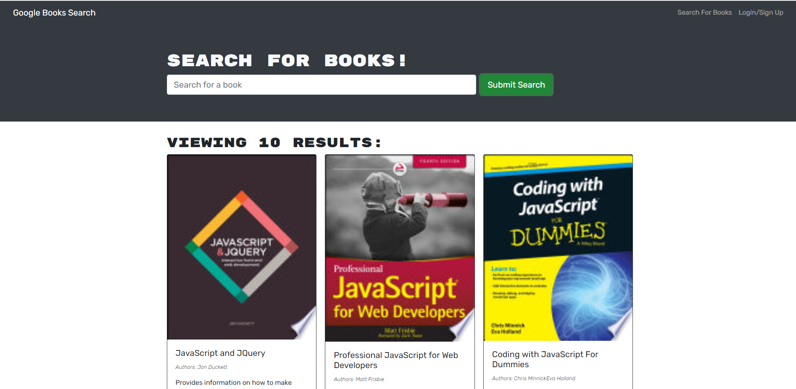
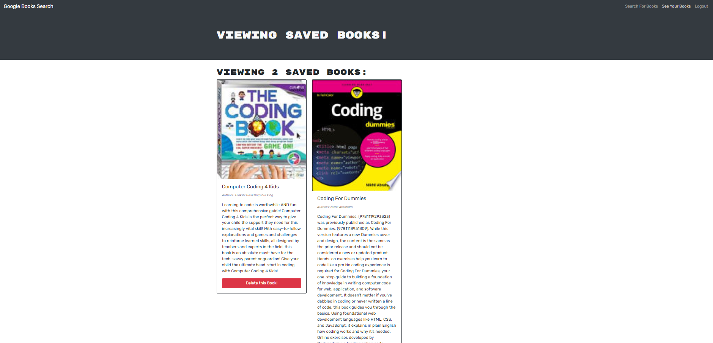
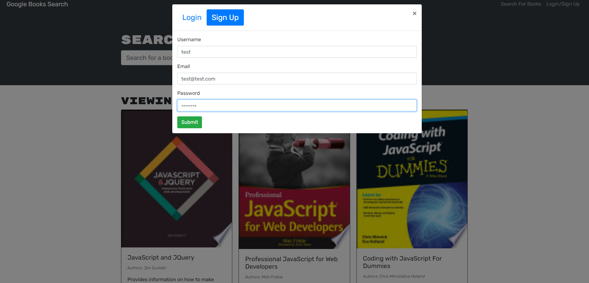

# Book-Search-Engine-MERN

## Description
* This app converts a fully functioning Google Books API search engine built with a RESTful API into a GraphQL API built with Apollo Server. Uses the MERN stack, with a React front end, MongoDB database, and Node.js/Express.js server and API.

## Table of Contents

- [Description](#Description)
- [Installation](#Installation)
- [Usage](#Usage)
- [Assets](#Assets)

## Installation

- You will need Node.js , MongoDB installed on your local machine.

- Clone the repository to your local environment

- git clone https://github.com/SrilalithaN/Book-Search-Engine-MERN

- The dependencies used in this application are "mongoose", "apollo-server-express", "apollo-client" and "graphql". All the dependencies are listed in package.json file.

- To install the dependencies run `npm install ` in the terminal

- To start the application run ` npm run develop` .

## Usage

* The application is depolyed on heroku

* Any user can search for books but only a registered user can save books for later use. 

* An existing user can login using credentials and search for books , save them and delete the saved books. 
* A new user can signup by entering username,email and password. 

## Assets
 * The following is link to deployed code on github : https://github.com/SrilalithaN/Book-Search-Engine-MERN

 * The following is the link to deployed application on heroku:

 * The following is the demo-video of the application: [DEMO](https://watch.screencastify.com/v/tWlZmq9EmqwEd61vSZy9)
